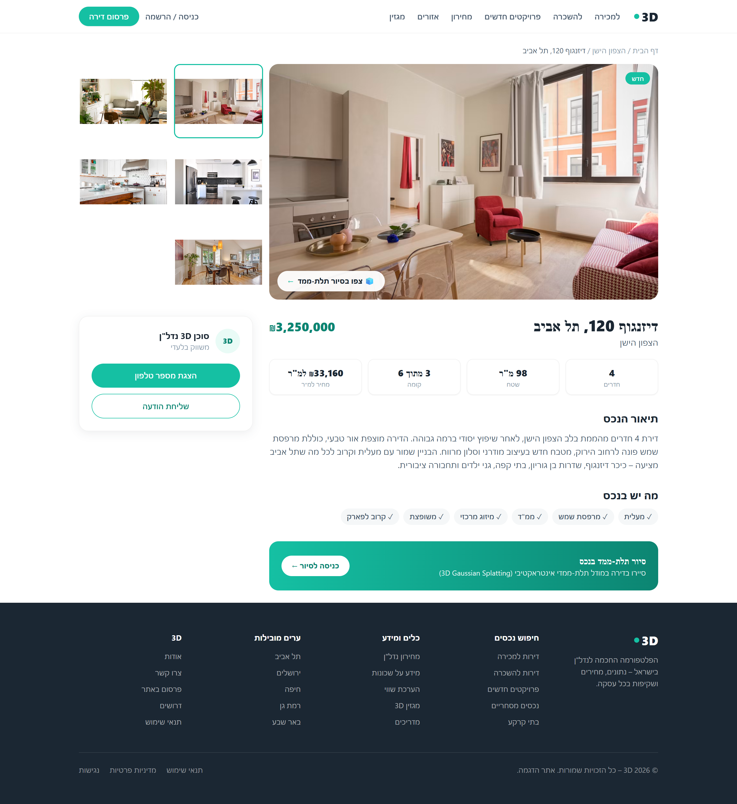
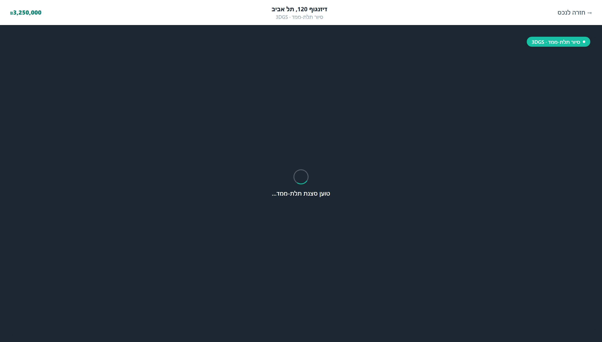

# 3D · נדל"ן עם סיור תלת-ממד

A Madlan-style Israeli real-estate site (Hebrew, RTL) built with **Next.js 14** and **Tailwind CSS**, featuring an example property with an interactive **3D Gaussian Splatting** tour rendered in the browser.

**🔗 Live demo: https://3dgs-realestate.vercel.app**

> Demo project — all listings, prices and images are mock data.

---

## ✨ Screenshots

### Homepage
A right-to-left landing page with a search hero, city tiles, a featured property, and tool sections — in Madlan's signature teal look.


### Property page
Image gallery with thumbnails, full description, specs, feature chips, an agent contact box, and two entry points into the 3D tour.



### 3D tour (Gaussian Splatting)
A full-screen WebGL viewer that streams a `.splat` scene with orbit / zoom / pan controls.



---

## 🧱 Tech stack

| Area | Choice |
|------|--------|
| Framework | [Next.js 14](https://nextjs.org/) (App Router) |
| Styling | [Tailwind CSS](https://tailwindcss.com/) |
| Font | Heebo (Hebrew) via `next/font` |
| 3D viewer | [`@mkkellogg/gaussian-splats-3d`](https://github.com/mkkellogg/GaussianSplats3D) + [three.js](https://threejs.org/) |
| Hosting | [Netlify](https://www.netlify.com/) (`@netlify/plugin-nextjs`) |

---

## 🚀 Getting started

### Prerequisites
- **Node.js 18.17+** (Node 20 recommended)
- npm

### Install & run

```bash
# install dependencies
npm install

# start the dev server (http://localhost:3000)
npm run dev
```

Then open **http://localhost:3000**.

### Other scripts

```bash
npm run build   # production build
npm run start   # serve the production build
npm run lint    # run Next.js ESLint
```

---

## 🗂️ Project structure

```
app/
  layout.js                 # RTL <html dir="rtl">, Heebo font, metadata
  page.js                   # homepage
  globals.css               # Tailwind + base styles
  property/[id]/
    page.js                 # property detail page
    tour/page.js            # full-screen 3D tour page
components/
  Header, Hero, Cities,     # homepage sections
  Listings, Tools, CtaBand, Footer
  PropertyDetail.js         # gallery + description + 3D links
  GaussianViewer.js         # client-only WebGL splat viewer
lib/
  properties.js             # mock property data (single example house)
docs/screenshots/           # README images
scripts/                    # Playwright screenshot helpers
```

---

## 🧊 The 3D viewer

`components/GaussianViewer.js` is a client component. All WebGL/three.js work is deferred to `useEffect`, so the page is safe to server-render and the heavy libraries load only on the client.

It currently streams a public sample scene. To show a **real capture of a property**, drop your file's URL into the data and the viewer will pick it up:

```js
// lib/properties.js — add a `splat` field to a property
splat: "https://your-host.com/apartment.ksplat",
```

```js
// then pass it through in app/property/[id]/tour/page.js
<GaussianViewer src={property.splat} />
```

Supported formats: `.splat`, `.ksplat`, and `.ply`. Files must be served with CORS enabled.

**Controls:** drag to rotate · scroll to zoom · right-click to pan.

---

## ☁️ Deployment (Netlify)

The repo includes `netlify.toml` configured with the official Next.js runtime.

**Git-based (recommended):** in the Netlify dashboard → *Add new site → Import an existing project* → pick this GitHub repo → **Deploy**. Every push to `main` redeploys.

**CLI:**

```bash
npx netlify-cli login
npx netlify-cli deploy --build --prod
```

---

## 📌 Notes

- Listings, prices, and photos are illustrative mock data.
- The 3D tour streams a ~31 MB sample `.splat` from an external host, so it isn't bundled with the app.
- Screenshots are generated with Playwright (`scripts/screenshots.mjs`).
